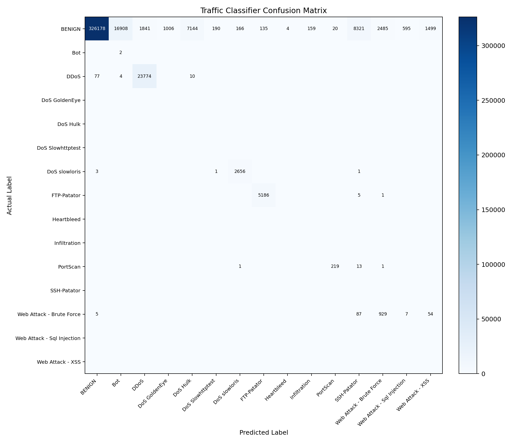

# AI DPI System Evaluation Report

## Summary

- Traffic model: `traffic_model_multiclass.pkl`
- Rows sampled per CICIDS file: `50000`
- Classifier accuracy: `0.8981`
- Anomaly detector F1-score: `0.0308`

## Classifier Per-Class Metrics

| Class | Precision | Recall | F1-score | Support |
|---|---:|---:|---:|---:|
| BENIGN | 0.9997 | 0.8896 | 0.9415 | 366651 |
| Bot | 0.0001 | 1.0000 | 0.0002 | 2 |
| DDoS | 0.9281 | 0.9962 | 0.9610 | 23865 |
| DoS GoldenEye | 0.0000 | 0.0000 | 0.0000 | 0 |
| DoS Hulk | 0.0000 | 0.0000 | 0.0000 | 0 |
| DoS Slowhttptest | 0.0000 | 0.0000 | 0.0000 | 0 |
| DoS slowloris | 0.9408 | 0.9981 | 0.9686 | 2661 |
| FTP-Patator | 0.9746 | 0.9988 | 0.9866 | 5192 |
| Heartbleed | 0.0000 | 0.0000 | 0.0000 | 0 |
| Infiltration | 0.0000 | 0.0000 | 0.0000 | 0 |
| PortScan | 0.9163 | 0.9359 | 0.9260 | 234 |
| SSH-Patator | 0.0000 | 0.0000 | 0.0000 | 0 |
| Web Attack - Brute Force | 0.2720 | 0.8586 | 0.4131 | 1082 |
| Web Attack - Sql Injection | 0.0000 | 0.0000 | 0.0000 | 0 |
| Web Attack - XSS | 0.0000 | 0.0000 | 0.0000 | 0 |

## Per-File Accuracy

| CICIDS File | Rows | Accuracy | Rows/sec | Predicted Labels |
|---|---:|---:|---:|---|
| Friday-WorkingHours-Afternoon-DDos.pcap_ISCX.csv | 49987 | 0.9259 | 28646.6 | BENIGN, Bot, DDoS, DoS GoldenEye, DoS Hulk, DoS Slowhttptest, DoS slowloris, FTP-Patator, Infiltration, SSH-Patator, Web Attack - Brute Force, Web Attack - Sql Injection, Web Attack - XSS |
| Friday-WorkingHours-Afternoon-PortScan.pcap_ISCX.csv | 49982 | 0.8879 | 28102.6 | BENIGN, Bot, DDoS, DoS GoldenEye, DoS Hulk, DoS Slowhttptest, DoS slowloris, FTP-Patator, Infiltration, PortScan, SSH-Patator, Web Attack - Brute Force, Web Attack - Sql Injection, Web Attack - XSS |
| Friday-WorkingHours-Morning.pcap_ISCX.csv | 49952 | 0.8928 | 29356.2 | BENIGN, Bot, DDoS, DoS GoldenEye, DoS Hulk, DoS Slowhttptest, DoS slowloris, FTP-Patator, Infiltration, SSH-Patator, Web Attack - Brute Force, Web Attack - Sql Injection, Web Attack - XSS |
| Monday-WorkingHours.pcap_ISCX.csv | 49934 | 0.9184 | 26141.1 | BENIGN, Bot, DDoS, DoS GoldenEye, DoS Hulk, DoS Slowhttptest, DoS slowloris, FTP-Patator, Heartbleed, Infiltration, PortScan, SSH-Patator, Web Attack - Brute Force, Web Attack - Sql Injection, Web Attack - XSS |
| Thursday-WorkingHours-Afternoon-Infilteration.pcap_ISCX.csv | 49983 | 0.8789 | 28910.0 | BENIGN, Bot, DDoS, DoS GoldenEye, DoS Hulk, DoS Slowhttptest, DoS slowloris, FTP-Patator, Infiltration, PortScan, SSH-Patator, Web Attack - Brute Force, Web Attack - Sql Injection, Web Attack - XSS |
| Thursday-WorkingHours-Morning-WebAttacks.pcap_ISCX.csv | 49941 | 0.8928 | 31913.1 | BENIGN, Bot, DDoS, DoS GoldenEye, DoS Hulk, DoS Slowhttptest, DoS slowloris, FTP-Patator, Heartbleed, Infiltration, SSH-Patator, Web Attack - Brute Force, Web Attack - Sql Injection, Web Attack - XSS |
| Tuesday-WorkingHours.pcap_ISCX.csv | 49956 | 0.8720 | 25067.8 | BENIGN, Bot, DDoS, DoS GoldenEye, DoS Hulk, DoS Slowhttptest, DoS slowloris, FTP-Patator, Heartbleed, PortScan, SSH-Patator, Web Attack - Brute Force, Web Attack - Sql Injection, Web Attack - XSS |
| Wednesday-workingHours.pcap_ISCX.csv | 49952 | 0.9158 | 27764.0 | BENIGN, Bot, DDoS, DoS GoldenEye, DoS Hulk, DoS Slowhttptest, DoS slowloris, FTP-Patator, Heartbleed, Infiltration, PortScan, SSH-Patator, Web Attack - Brute Force, Web Attack - Sql Injection, Web Attack - XSS |

## Confusion Matrix

## Interview Note

The supervised classifier is the primary detection component. The anomaly detector is kept as a secondary signal for unusual traffic patterns, but its current F1-score shows it needs further tuning before being used as the main alert source.
