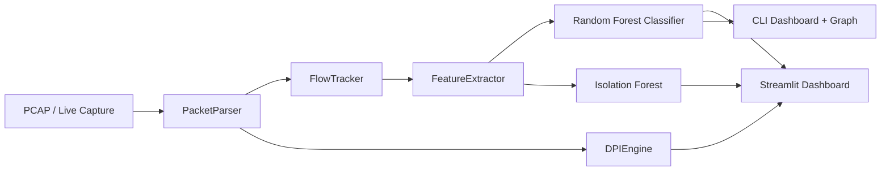

# AI-Based Deep Packet Inspection System

An ML-assisted network security prototype that analyzes traffic from **live capture** or **PCAP files**. It groups packets into flows, extracts CICIDS-aligned behavioral features, classifies attack types with a Random Forest model, flags statistical anomalies, and scans payloads with regex-based signatures.

Built for learning and demo purposes — closer to a lightweight IDS pipeline than a production firewall.

---

## Features

- **Flow-level ML classification** — 15 traffic classes (BENIGN, DDoS, PortScan, DoS variants, web attacks, etc.)
- **Signature-based DPI** — SQL injection, XSS, directory traversal, credential patterns
- **Anomaly detection** — Isolation Forest as a secondary signal
- **Streamlit dashboard** — upload PCAP, view flows/alerts, export CSV/Markdown reports
- **CLI pipeline** — live monitoring or offline PCAP with network graph visualization
- **Shared feature module** — training (CICIDS CSV) and inference (PCAP) use the same schema via `flow_features.py`

---

## Architecture



**Pipeline steps**

1. Read packets (Scapy `rdpcap` or `sniff`)
2. Parse IP, ports, TCP flags, payload, timestamps
3. Group into bidirectional flows
4. Extract 10 flow features aligned with CICIDS2017 / CICFlowMeter
5. Classify with Random Forest; optionally flag anomalies
6. Scan payloads with regex signatures
7. Display results in Streamlit or terminal + matplotlib graph

---

## Project Structure

```
ai_dpi_system/
├── main.py                      # CLI: live or PCAP analysis
├── streamlit_dashboard.py       # Web dashboard
├── flow_features.py             # Shared CICIDS ↔ PCAP feature definitions
├── packet_parser.py             # Scapy packet parsing
├── packet_reader.py             # PCAP / live capture
├── flow_tracker.py              # Bidirectional flow grouping
├── feature_extractor.py         # PCAP feature extraction wrapper
├── ai_classifier.py             # Random Forest inference
├── anomaly_detector.py          # Isolation Forest inference
├── dpi_engine.py                # Regex payload signatures
├── train_multiclass_cicids.py   # Train multi-class model (recommended)
├── evaluate_performance.py      # Evaluate models on CICIDS samples
├── validate_feature_alignment.py # Verify train/inference feature alignment
├── data/
│   ├── sample.pcap              # Small demo capture (included)
│   └── MachineLearningCVE/      # CICIDS2017 CSVs (download separately)
├── EVALUATION_REPORT.md         # Saved evaluation summary
└── PLACEMENT_PROJECT_SUMMARY.md # Interview / resume notes
```

---

## Requirements

- Python 3.10+
- Windows: [Npcap](https://npcap.com/) installed for live capture (Scapy)
- Linux/macOS: live capture typically requires `sudo`

---

## Setup

```bash
# Clone and enter the project
cd ai_dpi_system

# Create a virtual environment (recommended)
python -m venv .venv
.venv\Scripts\activate        # Windows
# source .venv/bin/activate   # Linux / macOS

# Install dependencies
pip install -r requirements.txt
```

### Models

The classifier and anomaly detector load from `.pkl` files in the project root:

| File | Purpose |
|------|---------|
| `traffic_model_multiclass.pkl` | Primary 15-class Random Forest (preferred) |
| `traffic_model.pkl` | Fallback binary/legacy model |
| `anomaly_model.pkl` | Isolation Forest anomaly detector |

If models are missing, train them (see [Training](#training) below).

### CICIDS2017 Dataset (for training / evaluation only)

1. Download [CICIDS2017 MachineLearningCVE](https://www.kaggle.com/datasets/cicdataset/cicids2017) (or the official UNB mirror).
2. Extract the CSV files into `data/MachineLearningCVE/`.
3. You should have 8 files such as `Friday-WorkingHours-Afternoon-DDos.pcap_ISCX.csv`.

These files are large (~700 MB total) and are **gitignored**. PCAP analysis works without them using `data/sample.pcap`.

---

## Usage

### Streamlit dashboard (recommended for demos)

```bash
streamlit run streamlit_dashboard.py
```

1. Open the URL shown in the terminal (usually `http://localhost:8501`)
2. Upload a `.pcap` file or use the built-in sample
3. Click **Analyze Traffic**
4. Review flows, alerts, and export reports

### CLI analysis

```bash
python main.py
```

- **Option 1** — Live network monitoring (requires admin / Npcap)
- **Option 2** — Analyze `data/sample.pcap`

### Validate feature alignment

Confirms PCAP feature extraction matches CICIDS conventions:

```bash
python validate_feature_alignment.py
```

### Evaluate models on CICIDS

```bash
python evaluate_performance.py --max-rows 50000
python generate_evaluation_report.py   # optional: refresh EVALUATION_REPORT.md
```

---

## Training

Train the multi-class classifier on all CICIDS CSV files:

```bash
python train_multiclass_cicids.py --max-rows-per-file 20000 --max-per-class 20000
```

Useful flags:

| Flag | Default | Description |
|------|---------|-------------|
| `--data-dir` | `data/MachineLearningCVE` | Path to CICIDS CSV folder |
| `--max-rows-per-file` | all rows | Limit rows per file for faster training |
| `--max-per-class` | `100000` | Cap samples per class before split |
| `--output-model` | `traffic_model_multiclass.pkl` | Output model path |

Train anomaly detector on CICIDS features:

```bash
python train_cicids2017.py
```

---

## Performance (current saved models)

From `EVALUATION_REPORT.md` (50,000 rows sampled per CICIDS file):

| Metric | Value |
|--------|------:|
| Classifier accuracy | ~89.8% |
| Strong classes | DDoS, PortScan, DoS slowloris, FTP-Patator |
| Weak classes | Bot, SQL Injection, XSS (rare / imbalanced) |
| Anomaly detector F1 | ~0.03 (experimental — not primary alert source) |

**Interview tip:** Lead with per-class F1, not overall accuracy. Say the system is strongest on volumetric attacks (DDoS, PortScan) and weaker on rare web attacks.

---

## Known Limitations

- Uses **10 simplified flow features**, not the full 78 CICIDS features — payload content is not fed to the classifier.
- **Anomaly detector** needs tuning; supervised classification is the primary signal.
- **Live capture** requires elevated permissions and a working packet driver (Npcap on Windows).
- **DPI signatures** are basic regex patterns — expect false positives on benign traffic.
- Rare attack classes have very few training samples even after balancing.

---

## Feature Alignment

Training and inference share one module: `flow_features.py`.

| Feature | CICIDS source | PCAP computation |
|---------|---------------|------------------|
| `packet_count` | Fwd + Bwd packets | Count of packets in flow |
| `avg/max/min/std_packet_size` | Packet Length stats | Stats over `IP.len` per packet |
| `flow_duration` | Flow Duration (µs → s) | Last timestamp − first timestamp |
| `bytes_per_second` | Flow Bytes/s | Total bytes / duration (1 µs floor) |
| `syn/ack/fin_count` | Flag counts | Scapy TCP flag bits per packet |

Forward direction follows **CICFlowMeter**: the first packet by timestamp defines forward vs backward.

---

## Resume Bullet

> Built an ML-assisted Deep Packet Inspection and intrusion detection prototype using Python, Scapy, and Scikit-learn on CICIDS2017 — combining flow-level Random Forest classification (15 classes), Isolation Forest anomaly detection, regex payload inspection, and a Streamlit PCAP analysis dashboard.

---

## License

Academic / portfolio use. CICIDS2017 dataset has its own terms — cite the original paper if publishing results.
